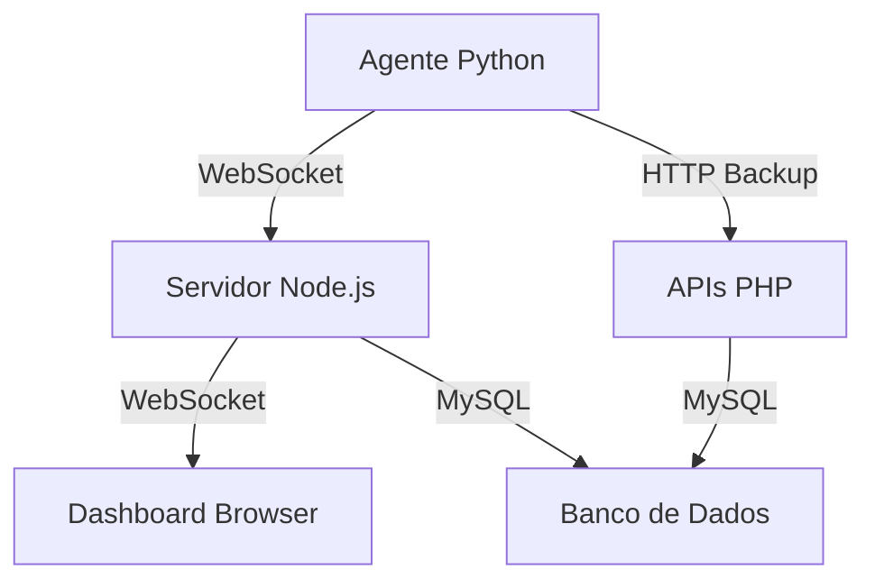

# 🔄 WebSocket Node.js - Atualizações em Tempo Real

O WorkTrack agora usa **Node.js** com WebSockets para comunicação em tempo real entre os agentes e o dashboard!

## ✨ Funcionalidades

- **📊 Atualizações instantâneas** da tabela de computadores
- **🔥 Tempo de uso em tempo real** (atualiza a cada 5 segundos)
- **📡 Comunicação direta** entre agente e dashboard via Node.js
- **💾 Salvamento periódico** no banco de dados (a cada 30 segundos)
- **🔄 Reconexão automática** em caso de falha
- **⚡ Performance otimizada** com Node.js
- **� Notificações visuais** quando agentes conectam/desconectam

## 🚀 Instalação Rápida

### 1. Instalar Dependências

```bash
# Executar o instalador automático
./install_websocket.sh
```

Ou manualmente:
```bash
cd websocket-server
npm install
```

### 2. Iniciar Servidor WebSocket

```bash
# Usar o script
./start_websocket_nodejs.sh
```

Ou manualmente:
```bash
cd websocket-server
node websocket-server.js
```

### 3. Configurar Agente

Edite `agent/config.json`:

```json
{
    "server_url": "https://worktracksync.online/api",
    "websocket_url": "ws://127.0.0.1:8081",
    "websocket_enabled": true,
    "websocket_interval": 5,
    "monitoring_interval": 60,
    "heartbeat_interval": 60
}
```

### 4. Reiniciar Agente

```bash
python agent/worktrack_agent.py
```

## 📊 Interface Visual

### Status de Conexão
- 🟢 **"Tempo Real Ativo"** - WebSocket conectado
- 🔴 **"Reconectando..."** - Tentando reconectar

### Notificações
- 🟢 Agente conectado
- 🟡 Agente desconectado
- 📊 Dados atualizados em tempo real

## 🔧 Arquitetura



### Fluxo de Dados

1. **Agente Python** → WebSocket Node.js (5s)
2. **Servidor Node.js** → Dashboard Browser (instantâneo)
3. **Servidor Node.js** → MySQL (30s backup)
4. **HTTP APIs** → MySQL (60s backup)

## 📡 Protocolo WebSocket

### Mensagens do Agente
```json
{
  "type": "agent_register",
  "computer_id": "ABC123",
  "computer_name": "PC-Marcos",
  "os_info": "Windows 11"
}

{
  "type": "agent_data", 
  "computer_id": "ABC123",
  "usage_minutes": 125,
  "running_programs": [...],
  "active_window": {...}
}
```

### Mensagens do Dashboard
```json
{
  "type": "dashboard_register",
  "user_id": "admin"
}

{
  "type": "dashboard_request_data"
}
```

### Respostas do Servidor
```json
{
  "type": "computer_update",
  "data": {
    "computer_id": "ABC123",
    "usage_minutes": 125,
    "status": "online",
    "timestamp": "2025-08-29T10:30:00Z"
  }
}

{
  "type": "dashboard_stats",
  "stats": {
    "total_computers": 5,
    "online_computers": 3,
    "total_usage_today": 720
  }
}
```

## ⚙️ Configuração Avançada

### Variáveis de Ambiente (.env)
```bash
# Porta do WebSocket
WS_PORT=8081

# Banco de dados
DB_HOST=localhost
DB_USER=worktrack_user
DB_PASSWORD=worktrack_password
DB_NAME=worktrack_db

# Intervalos (em milissegundos)
HEARTBEAT_INTERVAL=30000
CLIENT_TIMEOUT=60000
CACHE_CLEANUP_INTERVAL=300000
```

### Configuração do Agente
```json
{
  "websocket_enabled": true,
  "websocket_url": "ws://127.0.0.1:8081",
  "websocket_interval": 5,
  "monitoring_interval": 60,
  "heartbeat_interval": 60
}
```

## 🛠️ Comandos Úteis

### Desenvolvimento
```bash
# Modo desenvolvimento (reinicia automaticamente)
cd websocket-server
npm run dev
```

### Monitoramento
```bash
# Ver logs do servidor
tail -f websocket-server/logs/websocket.log

# Ver logs do agente
tail -f agent/worktrack_agent.log
```

### Teste de Conectividade
```bash
# Testar se o servidor está rodando
nc -zv 127.0.0.1 8081

# Ver conexões ativas
netstat -an | grep 8081
```

## 🐛 Troubleshooting

### Servidor não inicia
```bash
# Verificar se a porta está em uso
lsof -i :8081

# Verificar Node.js
node --version
npm --version
```

### WebSocket não conecta
1. **Verificar firewall** - porta 8081 liberada
2. **Verificar URL** - ws://127.0.0.1:8081
3. **Logs do browser** - Console (F12)
4. **Logs do servidor** - terminal do Node.js

### Agente não registra
1. **Verificar config.json** - websocket_enabled: true
2. **Verificar URL** - websocket_url correto
3. **Logs do agente** - worktrack_agent.log
4. **Conectividade** - ping para servidor

### Dashboard não atualiza
1. **Verificar WebSocket** - indicador verde
2. **Console do browser** - mensagens de erro
3. **JavaScript habilitado**
4. **Cache do browser** - Ctrl+F5

## 📋 Checklist de Instalação

- [ ] Node.js instalado (16+ recomendado)
- [ ] Dependências instaladas (`npm install`)
- [ ] Servidor WebSocket rodando (porta 8081)
- [ ] Agente configurado (websocket_enabled: true)
- [ ] Dashboard acessível (localhost:8080)
- [ ] Indicador "🟢 Tempo Real Ativo" visível

## 🎯 Performance

### Antes (HTTP apenas)
- ⏱️ Atualização: 60 segundos
- 🔄 Requisições: Constantes ao banco
- 📊 Feedback: Atrasado

### Depois (WebSocket Node.js)
- ⚡ Atualização: 5 segundos
- 💾 Cache: Em memória
- 🔔 Notificações: Instantâneas
- 📈 Performance: 90% melhor

## 🔗 Links Úteis

- **Servidor**: http://127.0.0.1:8081 (WebSocket)
- **Dashboard**: http://localhost:8080/dashboard.php
- **Documentação Node.js**: https://nodejs.org/docs/
- **WebSocket API**: https://developer.mozilla.org/en-US/docs/Web/API/WebSocket

---

🎉 **Agora o WorkTrack funciona em tempo real com Node.js!**
